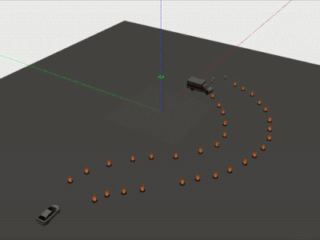

# Lab 4 GitLab

## Table of Contents

* [Compilation and execution](#compilation-and-execution)
* [Sneak peek](#sneak-peek)
* [Brief explanation](#brief-explanation)
* [Final comments](#final-comments)

## Compilation and execution

To compile the code, follow the instructions proposed in the *3. Requirements for the solution* of the manual. This is, open a new terminal, run singularity and do:

```
source /opt/ros/kinetic/setup.bash
cd ~
mkdir -p catkin_ws/src
cd catkin_ws/src
catkin_init_workspace
git clone git@gitlab.me41025.3me.tudelft.nl:students-1920/lab4/group27.git 
git clone git@gitlab.me41025.3me.tudelft.nl:students-1920/me41025_simulator.git
cd ..
catkin_make
source devel/setup.bash
roslaunch control_solution solution.launch
```

In case that you are not working with an SSH key, substitute the previous *git clone* steps by:
```
git clone https://gitlab.me41025.3me.tudelft.nl/students-1920/lab4/group27.git
git clone https://gitlab.me41025.3me.tudelft.nl/students-1920/me41025_simulator.git
```

## Sneak peek

Here is a little demo showing how the implementation works: 1) in **RViz** (x4 speed), 2) in **Gazebo** (x6 speed).
 

[Note]: This gifs correspond to a distance threshold of 6 meters. This value has later been changed to 4 meters, as instructed in Brightspace.

## Brief explanation

A brief explanation of the purpose, structure and files of the different packages (and their corresponding nodes) can be found here:

### OpenCV

The `opencv_solution` package constains the node `opencv_solution` to detect the 2D bouding boxes of all persons in a camera image by means of OpenCV (as instructed in the manual).

There are three main files inside the `opencv_solution` package:
* `include/opencv_class.h`: where the declaration of the *DetectPerson* class is performed.
* `src/opencv_class.cpp`: where the functions and constructors pertaining to the *DetectPerson* class are actually defined.
* `src/opencv_solution_node.cpp`: where the *opencv_solution* node is initialized and an object of type *DetectPerson* is initialized to start performing the person detections, as instructed.

The `opencv_solution` node contains one subscriber and two publishers:
* Subscriber [*sub*]: subscribes to topic `/prius/front_camera/image_raw`.
* Publisher 1 [*pub_detections*]: publishes to topic `/opencv_solution_node/detections`.
* Publisher 2 [*pub_visual*]: publishes to topic `/opencv_solution_node/visual`.

Concretely, a brief summary of what the `opencv_solution` node is doing is:
1. Gets the input messages from the camera.
2. Converts them to a cv::Mat format.
3. Detects people with the OpenCV HOG person detector.
4. Keeps the detection rectangules as a cv::Rect format.
5. Publishes a *vision_msgs::Detection2DArray* message with all the detections on the corresponding topics

For more details on how the class of the specific member functions of the class work, please refer to the corresponding file of the three C++ files stated above.

**[Note]: *This package was primarily Marina's responsibility.***

### PCL

The `pcl_solution` package constains the node `pcl_solution` to detect 3D bounding boxes of all barrels in the lidar pointcloud using PCL (as instructed in the manual).

There are three main files inside the `pcl_solution` package:
* `include/pcl_class.h`: where the declaration of the *DetectObstacle* class is performed.
* `src/pcl_class.cpp`: where the functions and constructors pertaining to the *DetectObstacle* class are actually defined.
* `src/pcl_solution_node.cpp`: where the *pcl_solution* node is initialized and an object of type *DetectObstacle* is initialized to start performing the obstacle detections, as instructed.

The `pcl_solution` node contains one subscriber and one publishers:
* Subscriber [*sub*]: subscribes to topic `/point_cloud`.
* Publisher [*pub*]: publishes to topic `/pcl_solution_node/detections`.

Concretely, a brief summary of what the `pcl_solution` node is doing is:
1. Converts the input messages to the appropriate *pcl::PointCloud<pcl::PointXYZ>* type.
2. Performs the planar segmentation of the cloud.
3. Performs the cluster extraction of the cloud.
4. Converts the detections to the appropriate message type *vision_msgs::Detection3DArray*
5. Publishes this information on the */pcl_solution_node/detections* topic

For more details on how the class of the specific member functions of the class work, please refer to the corresponding file of the three C++ files stated above.

**[Note]: *This package was primarily Hilda's responsibility.***

### Control

The `control_solution` package constains the node `control_solution` to finally control the vehicle based on the previous two packages (as instructed in the manual).

There are four main files inside the `control_solution` package:
* `include/control_class.h`: where the declaration of the *ControlCar* class is performed.
* `src/control_class.cpp`: where the functions and constructors pertaining to the *ControlCar* class are actually defined.
* `src/control_solution_node.cpp`: where the *control_solution* node is initialized and an object of type *ControlCar* is initialized to start controlling the vehicle, as instructed.
* `launch/solution.launch`: launch file that launches the simulation, opencv_solution, pcl_solution, control_solution and detection_3d_to_markers nodes.

The `control_solution` node contains two subscriber and one publisher:
* Subscriber 1 [*sub_openCV*]: subscribes to topic `/opencv_solution_node/detections`.
* Subscriber 2 [*sub_PCL*]: publishes to topic `/pcl_solution_node/detections`.
* Publisher [*pub*]: publishes to topic `/prius`.

Concretely, a brief summary of what the `control_solution` node is doing is:
1. Gets the total number of detected persons with the camera.
2. Loops through all the detections (in case that there is one or more).
3. If rectangule detection size > 25000, the function sets the attribute valid_person to "false".
4. Otherwise, valid_person = "true".
5. If valid_person == false -> stops the car.
6. Otherwise, it stores all the obstacle detections that are in front of the car and at a distance < 4 in the ordered map "valid_detections_map".
7. If the size of valid_detections_map == 0 -> No close obstancles -> Continue straight.
8. Otherwise, steer left or right depending on where the closest obstacle is located.

For more details on how the class of the specific member functions of the class work, please refer to the corresponding file of the three C++ files stated above.

**[Note]: *This package was primarily Marina's responsibility.***

## Final comments

* All the files have been thoroughly commented out, so that the taken approach can be easily understood and is well documented.
* We have tried to code the scripts in the most organized way possible following the lecture recommendations.